# Geração de gráficos comerciais personalizados em SVG

Como calcular e gerar gráficos de coluna, linha, híbridos coluna e linha, pizza, e customizados em diversos formatos e apresentações.

exportação em:
* svg
* svgz
* png
* jpg
* tif

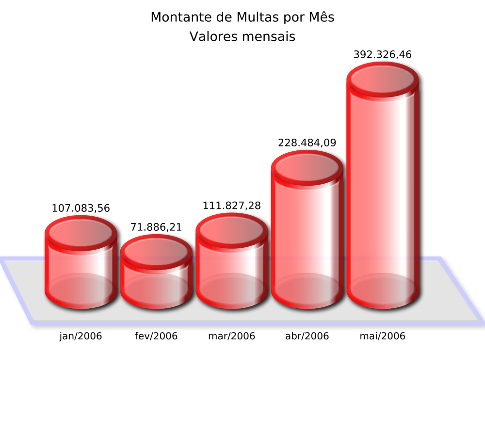
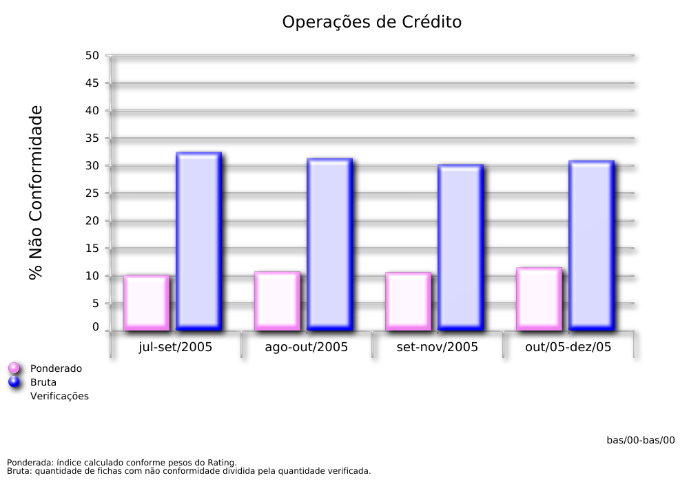
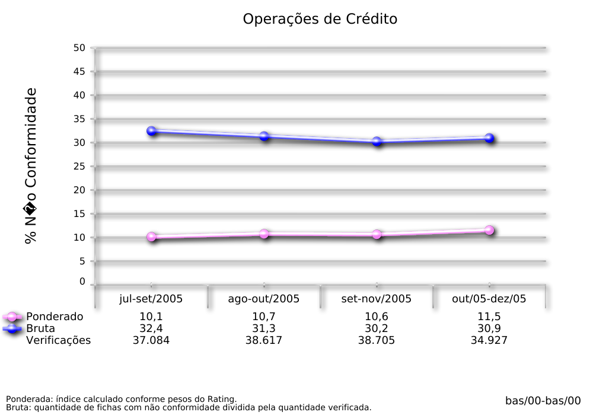
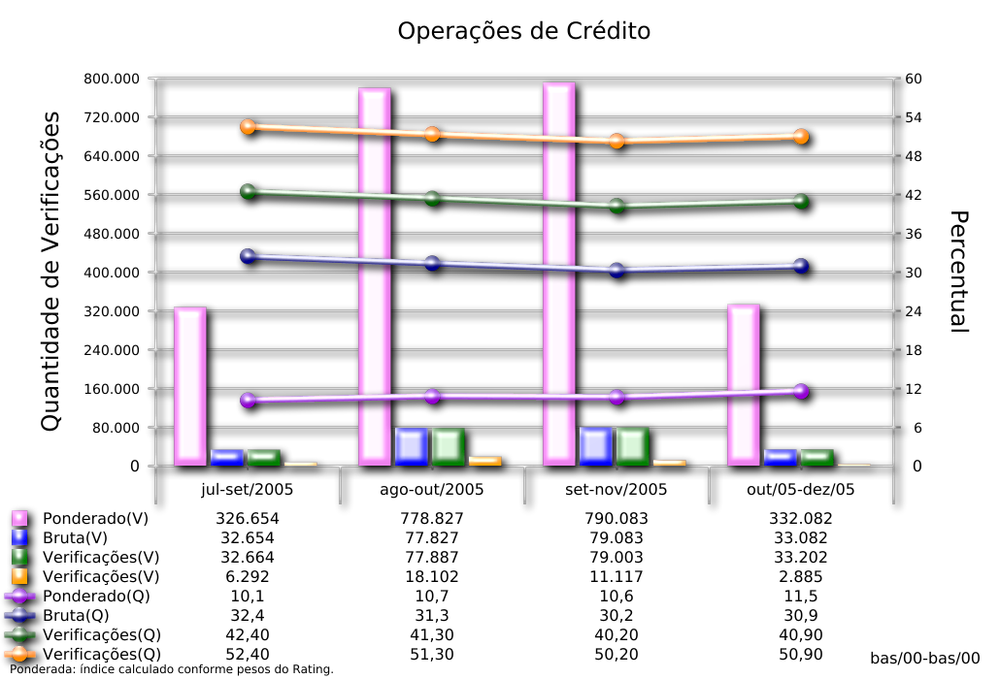
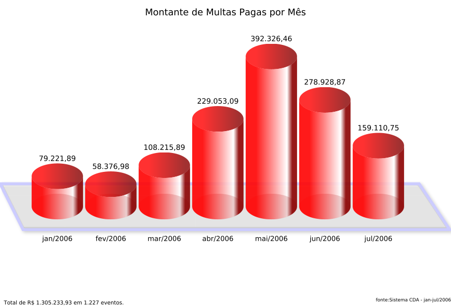
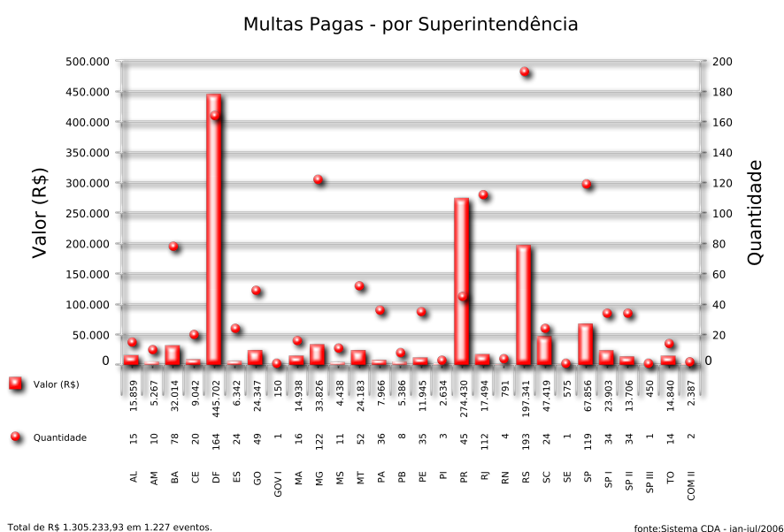
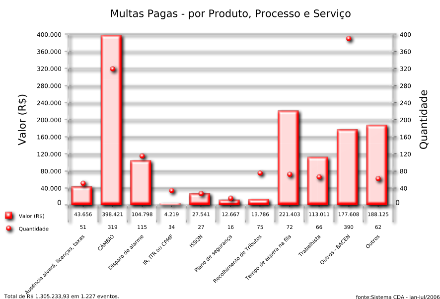
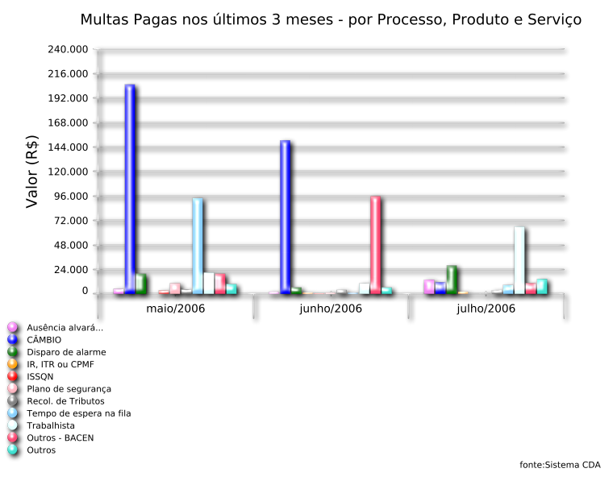
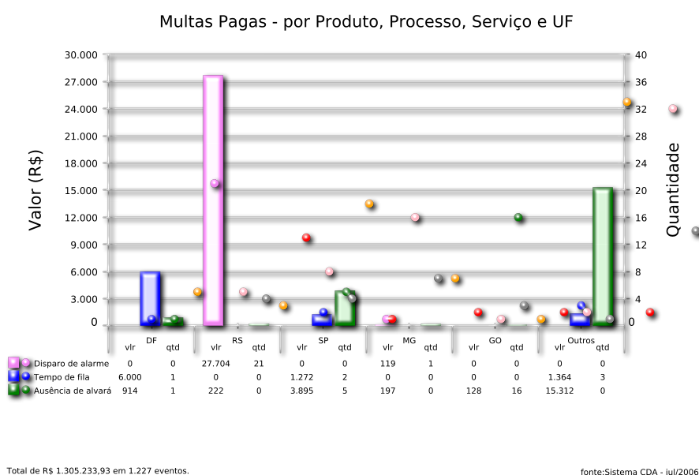
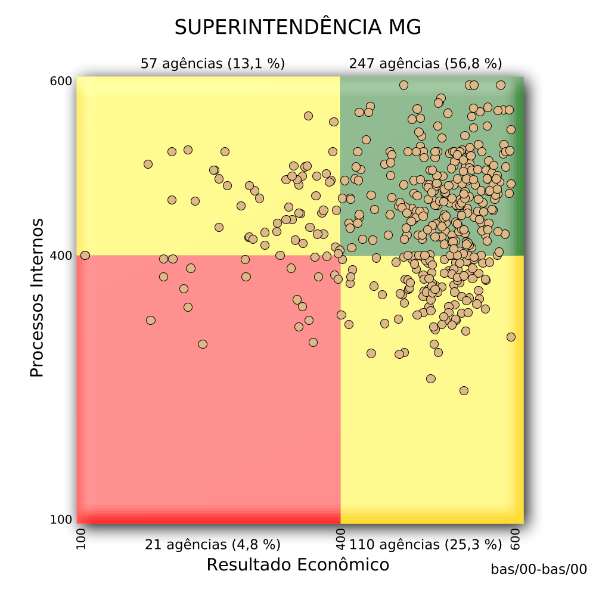
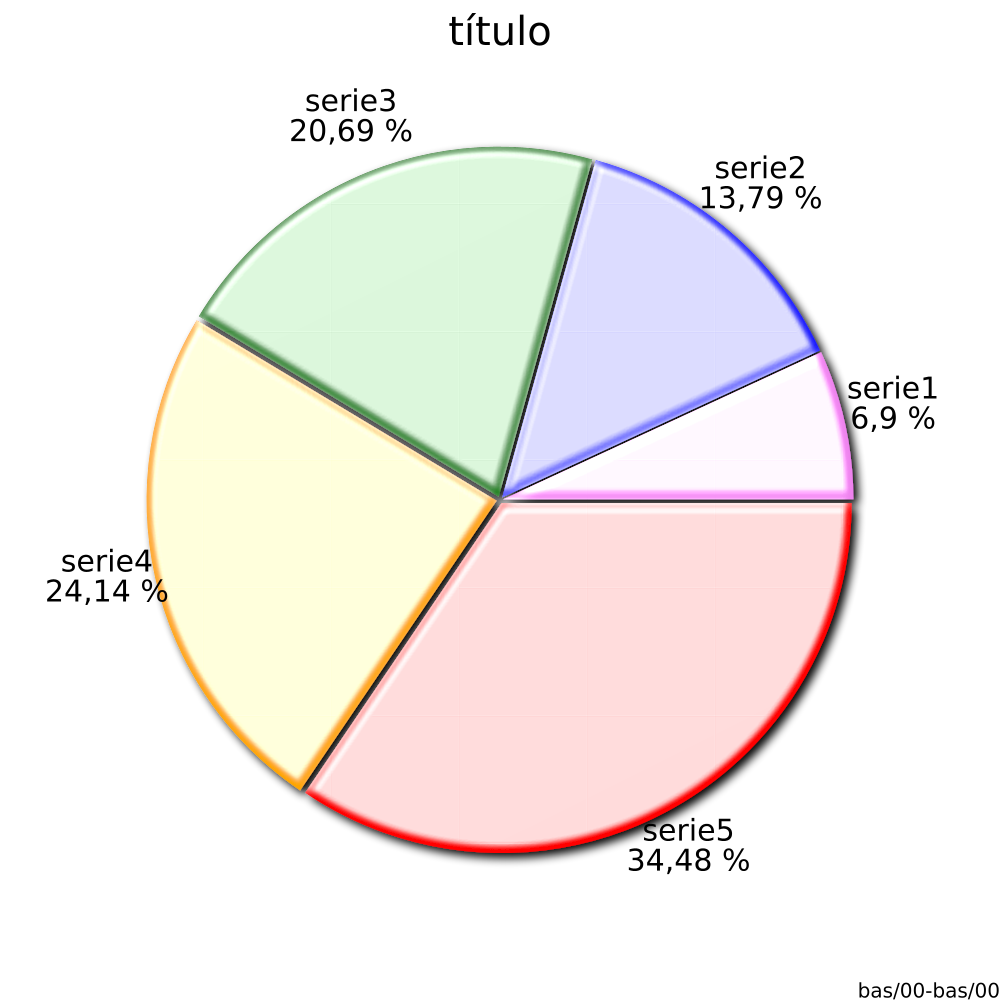
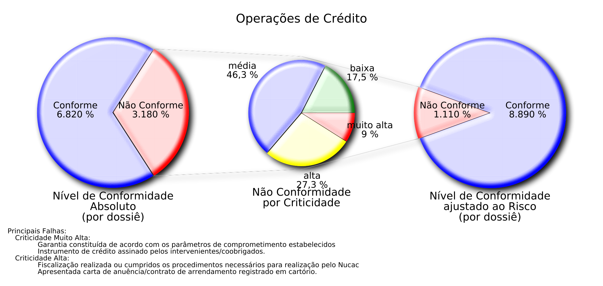
